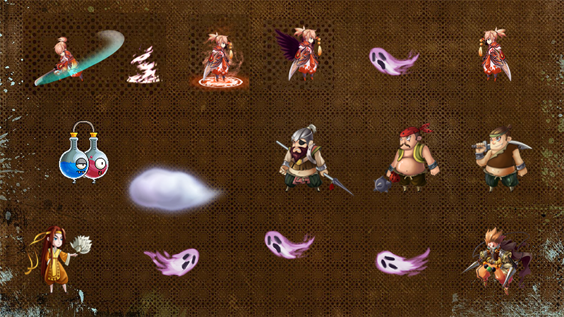

# Construct2Game

<p align="center">
  
</p>

这是一个以 Construct2 游戏资源为核心的桌面项目工作区，当前同时保留了三套桌面实现：

- `wails3-go/`：新版桌面壳，基于 `Wails 3 + Go`，当前推荐日常运行和分发
- `godot4-port/`：`Godot 4` 原生重制版，当前已经可玩并已验证导出 Windows 可执行文件
- `javafx-legacy/`：旧版桌面壳，基于 `Java 21 + JavaFX WebView`，作为兼容保留版本继续存在

三套版本共用同一套游戏素材与核心玩法，差异主要在运行时外壳、窗口封装方式、资源加载链路以及后续维护方向。

## 项目状态

| 版本 | 技术栈 | 当前定位 | 状态 |
| --- | --- | --- | --- |
| `wails3-go` | Wails 3 + Go + Vite | 主力桌面版本 | 推荐日常运行、开发与打包 |
| `godot4-port` | Godot 4 原生实现 | 原生重制版本 | 已可运行，已验证导出 Windows `.exe` |
| `javafx-legacy` | Java 21 + JavaFX WebView + Maven | 兼容保留版本 | 可启动，但仍可能存在 WebView 显示兼容问题 |

## 界面与玩法预览

三套版本共用同一套核心游戏资源，下面这两张图可以直接代表当前项目的主视觉与操作说明。

### 开始画面



### 操作说明画面


## 版本说明

### Wails 3 + Go 版

目录：

```text
Construct2Game/wails3-go
```

这是当前推荐使用的桌面版本，特点是：

- 使用原生桌面窗口承载 Construct2 导出的网页游戏资源
- 顶部工具栏集成了 `返回主菜单`、`重新加载`、`游戏说明`、`运行环境`、`全屏`
- 支持系统托盘、菜单栏、窗口隐藏与恢复
- 已验证可以打包出 macOS 可执行文件和 Windows `.exe`
- 当前整体运行稳定性最好，适合作为默认分发版本

详细说明见：

- [wails3-go/README.md](./wails3-go/README.md)

### Godot 4 原生版

目录：

```text
Construct2Game/godot4-port
```

这是当前的原生重制版本，特点是：

- 不再依赖 WebView，直接以 `Godot 4` 原生节点、场景和脚本重建游戏流程
- 已重建主菜单、游戏说明、选关页、5 个战斗关卡、通关页和游戏内 HUD
- 使用从原 Construct2 数据中提取的关卡、动画和布局信息，尽量保留原版节奏与视觉结构
- 已验证导出 Windows 可执行文件：`godot4-port/build/windows/Construct2Game-Godot.exe`
- 更适合继续做原生玩法迭代、逻辑调试和后续解耦重构

详细说明见：

- [godot4-port/README.md](./godot4-port/README.md)

### JavaFX Legacy 版

目录：

```text
Construct2Game/javafx-legacy
```

这是保留的旧桌面实现，特点是：

- 已迁移到 `Java 21 + JavaFX`
- 保留了原来的 Java 桌面壳思路
- 支持 `F11` 全屏、窗口图标、托盘回退和 WebView 重载
- 更适合作为历史版本保留、代码参考和兼容性对照

当前状态说明：

- 这个版本可以启动
- 但根据当前测试结果，仍可能存在 WebView 点击、显示或渲染兼容问题
- 如果是实际游玩或对外分发，优先建议使用 `wails3-go` 或 `godot4-port`

详细说明见：

- [javafx-legacy/README.md](./javafx-legacy/README.md)

## 快速开始

### 推荐启动方式

如果你只是想直接启动当前主力桌面版本，在根目录运行：

```bash
cd Construct2Game
./start-game.command
```

对应平台脚本：

- macOS: [start-game.command](./start-game.command)
- Linux: [start-game.sh](./start-game.sh)
- Windows: [start-game.bat](./start-game.bat)

### 直接进入 Wails 版

macOS:

```bash
cd Construct2Game/wails3-go
./run-dev.command
```

Linux:

```bash
cd Construct2Game/wails3-go
./run-dev.sh
```

Windows:

```powershell
cd Construct2Game\wails3-go
run-dev.bat
```

### 直接进入 Godot 4 版

开发方式：

```text
用 Godot 4 打开 godot4-port/project.godot
```

如果已经导出 Windows 包，也可以直接运行：

```text
godot4-port/build/windows/Construct2Game-Godot.exe
```

### 直接进入 Java 版

macOS:

```bash
cd Construct2Game/javafx-legacy
./run-mac.command
```

Linux:

```bash
cd Construct2Game/javafx-legacy
./run-linux.sh
```

Windows:

```powershell
cd Construct2Game\javafx-legacy
run-windows.bat
```

## 打包说明

### Wails 版打包

当前已经验证可以生成：

- `wails3-go/bin/Construct2Game`
- `wails3-go/bin/Construct2Game.exe`

### Godot 4 版打包

当前已经验证可以生成：

- `godot4-port/build/windows/Construct2Game-Godot.exe`

如果要重新导出 Windows 包，可以在安装好 Godot 4 导出模板后执行：

```powershell
cd E:\Workplace\Construct2Game
"C:\Users\Harry\AppData\Local\Microsoft\WinGet\Packages\GodotEngine.GodotEngine_Microsoft.Winget.Source_8wekyb3d8bbwe\Godot_v4.6.2-stable_win64_console.exe" --headless --path "E:\Workplace\Construct2Game\godot4-port" --export-release "Windows Desktop" "build/windows/Construct2Game-Godot.exe"
```

### Java 版运行与构建

Java 版当前主要作为兼容保留版本，常用命令：

```bash
cd Construct2Game/javafx-legacy
./mvnw -q test
./mvnw -DskipTests javafx:run
```

## 目录结构

```text
Construct2Game/
├── README.md
├── start-game.command
├── start-game.sh
├── start-game.bat
├── godot4-port/
│   ├── README.md
│   └── ...
├── javafx-legacy/
│   ├── README.md
│   └── ...
└── wails3-go/
    ├── README.md
    └── ...
```

## 选择建议

- 想直接玩、继续开发桌面壳、对外分发：优先用 `wails3-go`
- 想继续做原生玩法迭代、关卡逻辑调整、Godot 方向维护：用 `godot4-port`
- 想保留旧实现、研究 Java 桌面封装方式、做历史对照：看 `javafx-legacy`
